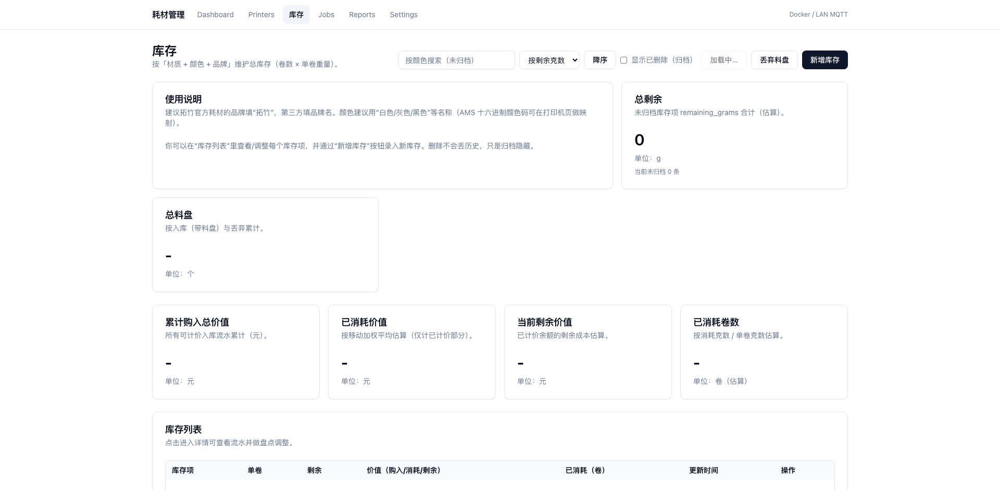

# 3D耗材管理系统 - 宣传材料

## 系统简介

3D耗材管理系统是一个专为拓竹打印机设计的局域网耗材管理系统，通过 **LAN MQTT** 连接打印机，实时监控打印状态与AMS托盘信息，自动记录耗材消耗并生成成本统计。系统提供直观的Web界面，帮助用户轻松管理3D打印耗材，跟踪消耗情况，并进行成本分析。

## 核心功能

### 🖨️ 打印机管理与实时监控


系统提供全面的打印机管理功能，包括：
- **打印机接入管理**：支持添加/删除打印机，保存IP/序列号/LAN访问码
- **实时状态监控**：自动获取并显示打印机在线状态、打印进度、当前任务
- **MQTT数据采集**：通过局域网直连打印机，订阅设备报告并实时解析
- **托盘信息展示**：显示当前使用托盘及所有AMS托盘状态（颜色、材质、剩余量）

仪表板提供系统概览，显示在线打印机数量、正在打印的任务数以及耗材消耗趋势。

### 🖨️ 打印机管理


打印机管理页面提供：
- 打印机列表展示
- 实时状态监控
- 设备详情查看
- 托盘信息展示
- 快速操作入口

### 🧵 耗材卷管理



全面的耗材卷管理功能：
- **耗材卷信息录入**：记录材质、颜色、初始重量、价格、供应商等详细信息
- **托盘绑定管理**：支持将耗材卷绑定到打印机特定托盘，可随时解绑
- **库存状态跟踪**：自动维护耗材卷状态（使用中、用完、报废等）
- **库存调整记录**：支持手动盘点调整，保持库存数据准确性

### 📊 自动消耗记录与成本统计


智能化的消耗记录与成本统计：
- **智能消耗计算**：打印结束时自动记录消耗，支持多种计算策略
  - AMS剩余量差值（首选）
  - 切片文件元数据估算（备选）
  - 人工录入/纠错（兜底）
- **自动成本核算**：根据耗材价格自动计算单次打印成本
- **消耗记录追溯**：每条消耗记录关联具体打印任务和耗材卷
- **多色打印支持**：支持多托盘打印的消耗分摊计算

### 📈 历史查询与报表


全面的历史查询与报表功能：
- **打印任务历史**：记录所有打印任务详情，包括状态、时长、耗材消耗
- **耗材卷账本**：查看每个耗材卷的完整使用历史和剩余量变化
- **消耗统计报表**：按时间、材质、打印机等维度统计耗材使用情况
- **数据导出功能**：支持将报表数据导出为CSV格式

### ⚙️ 系统设置


灵活的系统配置：
- 打印机配置管理
- 颜色映射设置
- 系统参数调整
- 数据导入导出

## 技术特点

- **现代化架构**：基于Next.js前端和FastAPI后端的现代Web应用
- **容器化部署**：提供Docker Compose一键部署方案，支持快速启动
- **实时数据采集**：通过MQTT协议实时获取打印机状态和耗材信息
- **数据库支持**：使用PostgreSQL存储数据，支持完整的历史记录追踪
- **响应式设计**：支持各种屏幕尺寸，适配桌面和移动设备

## 快速部署

### 系统要求

- Docker 20.10+
- Docker Compose v2.0+
- 至少2GB可用内存
- 至少5GB可用磁盘空间

### 部署步骤

1. **准备环境文件**
   
   创建环境配置文件：
   ```bash
   wget https://raw.githubusercontent.com/yangtao121/3d-consumables-management/main/env.ghcr.example -O .env
   ```

2. **配置环境变量**
   
   编辑 `.env` 文件，至少修改以下关键配置：
   ```bash
   # 修改为你的GitHub用户名或组织名
   IMAGE_OWNER=your-username
   
   # 设置安全密钥
   APP_SECRET_KEY=your-secure-secret-key
   
   # 设置前端访问地址（替换为你的服务器IP）
   NEXT_PUBLIC_API_BASE_URL=http://your-server-ip:8000
   ```

3. **拉取并启动服务**
   
   ```bash
   # 下载docker-compose配置
   wget https://raw.githubusercontent.com/yangtao121/3d-consumables-management/main/docker-compose.ghcr.yml
   
   # 启动服务（会自动拉取镜像）
   docker compose -f docker-compose.ghcr.yml up -d
   ```

4. **验证部署**
   
   检查服务状态：
   ```bash
   docker compose -f docker-compose.ghcr.yml ps
   ```
   
   访问以下地址验证：
   - 后端API文档：`http://your-server-ip:8000/docs`
   - 前端界面：`http://your-server-ip:3000`

### 开发环境部署

如需在本地开发环境运行：

```bash
# 克隆仓库
git clone https://github.com/yangtao121/3d-consumables-management.git
cd 3d-consumables-management

# 复制环境变量文件
cp env.example .env

# 启动服务
docker compose up -d
```

## 镜像信息

本系统使用以下预构建镜像（自动更新）：
- API服务：`ghcr.io/yangtao121/3d-consumables-api:latest`
- 采集器服务：`ghcr.io/yangtao121/3d-consumables-collector:latest`
- 前端服务：`ghcr.io/yangtao121/3d-consumables-frontend:latest`

如需使用特定版本，可修改 `.env` 文件中的 `IMAGE_TAG` 变量，例如 `IMAGE_TAG=v1.0.0`。

## 使用场景

### 🏠 家庭用户
- 追踪家用3D打印机的耗材使用情况
- 计算打印成本，合理规划购买预算
- 管理多台打印机的耗材状态

### 🏢 学校/教育机构
- 集中管理多台教学用3D打印机
- 统计各部门/班级的耗材使用情况
- 制定耗材采购计划

### 🏭 企业/工作室
- 精确计算项目成本
- 跟踪耗材库存，避免断料
- 生成耗材使用报表，支持财务核算

## 联系方式

- 项目地址：https://github.com/yangtao121/3d-consumables-management
- 问题反馈：请在GitHub提交Issue
- 功能建议：欢迎提交Pull Request

---

*本系统完全开源，遵循MIT许可证，欢迎自由使用、修改和分发。*